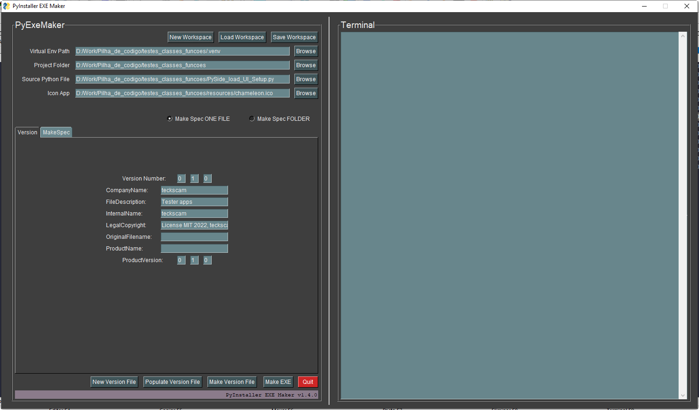

<!-- PROJECT LOGO -->
<br />
  <h2 align="center">PySimpleGui-ExeMaker</h2>

  <p align="center">
    <p align="center">
  <a href="https://github.com/othneildrew/Best-README-Template">
    
  </a>
    <br />
    <p align="center">
    -
    </p>
    <p align="center">
    <a href="https://github.com/othneildrew/Best-README-Template"><strong>Explore the documentation »</strong></a>
    <br />
  </p>
</p>


<!-- TABLE OF CONTENTS -->
<details open="open">
  <summary>Table of Contents</summary>
  <ol>
    <li>
      <a href="#about-the-project">About The Project</a>
      <ul>
        <li><a href="#built-with">Built With</a></li>
      </ul>
    </li>
    <li>
      <a href="#getting-started">Getting Started</a>
      <ul>
        <li><a href="#prerequisites">Prerequisites</a></li>
        <li><a href="#installation">Installation</a></li>
      </ul>
    </li>
    <li><a href="#usage">Usage</a></li>
    <li><a href="#roadmap">Roadmap</a></li>
    <li><a href="#change-log">Change log</a></li>
    <li><a href="#contributing">Contributing</a></li>
    <li><a href="#license">License</a></li>
    <li><a href="#contact">Contact</a></li>
    <li><a href="#acknowledgements">Acknowledgements</a></li>
  </ol>
</details>


<!-- ABOUT THE PROJECT -->
## About The Project
<!-- 
[![Product Name Screen Shot][product-screenshot]](https://example.com)
-->

Inspired in [PyExeMaker](https://pyexemaker.soft112.com), with [PySimpleGui](https://github.com/PySimpleGUI/PySimpleGUI) and the same style.

Here's why:

* Create exe files more eficient and procedures to compile python script more easy.
* Exe file with extra information autosaved.

### Built With

* [PySimpleGui](https://github.com/PySimpleGUI/PySimpleGUI)
* [PyInstaller](https://github.com/pyinstaller/pyinstaller)

<!-- GETTING STARTED -->
## Getting Started

<!--
All you need to use the software.

Portable folder mode. Note: only use config folder "user/local/PySimpleGui-ExeMaker"
 * Download folder [PySimpleGui-ExeMaker]() open and run exe file !

 or
 
 * make and compile your self
 #
-->

### Prerequisites

* Clone the repo
   ```sh
   git clone https://github.com/teckscam/PyExeMaker.git
 
* Create a virtual env
  ```sh
  python venv venv
  ```
* Install modules from requirements file
  ```sh
  pip install -r requirements.txt
  ```
* Use poetry commands
```
    poetry build <package>

```

   ```
<!-- USAGE EXAMPLES -->

<!-- ROADMAP -->
## Roadmap

See the [open issues](https://github.com/teckscam/PyExeMaker/issues) for a list of proposed features (and known issues).

---
<!-- Changelog -->
## Change log

 View file - [Change Log](changelog.md)

---

<!-- CONTRIBUTING -->
## Contributing

Contributions are what make the open source community such an amazing place to be learn, inspire, and create. Any contributions you make are **greatly appreciated**.

1. Fork the Project
2. Create your Feature Branch (`git checkout -b feature/AmazingFeature`)
3. Commit your Changes (`git commit -m 'Add some AmazingFeature'`)
4. Push to the Branch (`git push origin feature/AmazingFeature`)
5. Open a Pull Request

<!-- LICENSE -->
## License

Distributed under the MIT License. See `LICENSE` for more information.

<!-- CONTACT -->
## Contact

Paulo Santos - [GitHub](https://github.com/teckscam) - teckscam@gmail.com

Project Link: [https://github.com/teckscam/PyExeMaker](https://github.com/teckscam/PyExeMaker)

